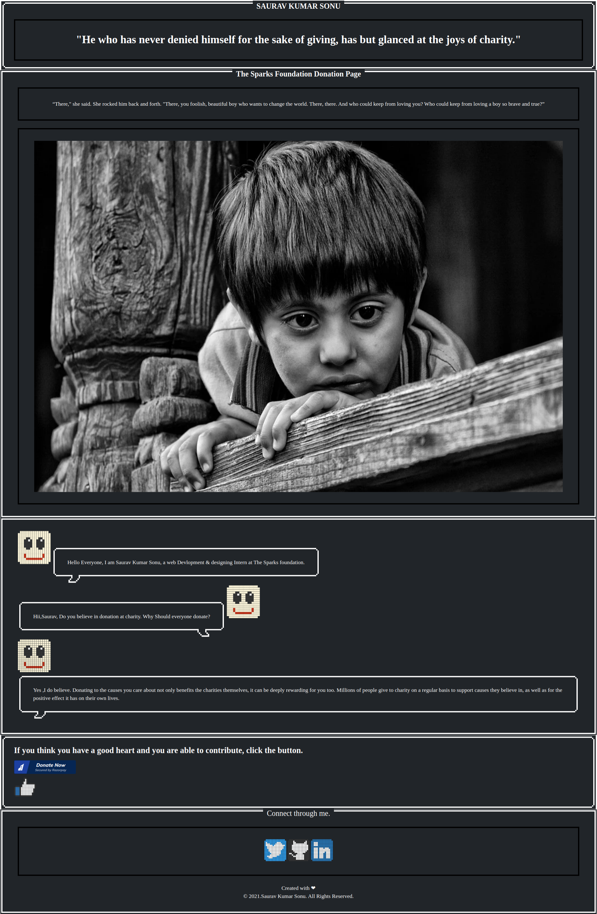

# The Sparks Foundation - Payment Gateway Integration

This is a solution to the [#Task-3].  

## Table of contents

- [Payment Gateway Integration - The Sparks Foundation](#Payment Gateway Integration - The Sparks Foundation)
  - [Table of contents](#table-of-contents)
  - [Overview](#overview)
    - [The challenge](#the-challenge)
    - [Screenshot](#screenshot)
    - [Links](#links)
  - [My process](#my-process)
    - [Built with](#built-with)
    - [What I learned](#what-i-learned)
    - [Useful resources](#useful-resources)
  - [Author](#author)
  - [Acknowledgments](#acknowledgments)
  
  - [Useful resources](#useful-resources)
- [Author](#author)
- [Acknowledgments](#acknowledgments)

## Overview

### The challenge

Users should be able to:

- View the optimal layout for the component depending on their device's screen size
- User will simply click the payment button and will be able to donate.

### Screenshot

### Links

- Solution URL: [Github](https://github.com/ItsmeSauravSonu/Donation-page_payment_gateway)
- Live Site URL: [Github pages](https://itsmesauravsonu.github.io/Donation-page_payment_gateway/)

## My process

### Built with

- Semantic HTML5 markup
- CSS 
- Ness.CSS framework
-RazorPay API
  

### What I learned

With making this project, I learnt to integarte payment gateway to the webpage

### Useful resources

- [NESS.css Framework](https://nostalgic-css.github.io/NES.css/) - It's an amazing framework with cool stuffs.
- [API Reference Guide](https://razorpay.com/docs/api/) - Official documention of RazorPay API

## Author

- Linkedin - [Saurav Kumar Sonu](https://www.linkedin.com/in/sauravkumarsonu/)
<!-- - Frontend Mentor - [ItsmeSauravSonu](https://www.frontendmentor.io/profile/ItsmeSauravSonu) -->
- Twitter - [@saurav_s07](https://www.twitter.com/saurav_s07)

## Acknowledgments

I would like to thank The Sparks Foundation for giving me this opportunity.

